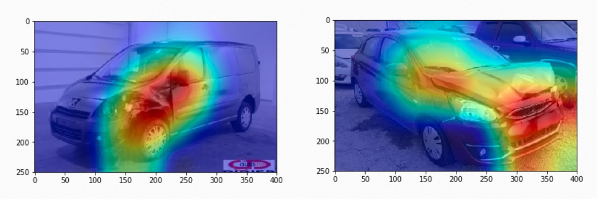

# Image-LAB-for-training
用tensorflow和keras跑圖片分類的基礎教學，包含以下程式碼。  
### 1 First Neural Network.ipynb
此範例說明如何用tensorflow跑簡單的回歸預測。    
### 2 Computer-Vision.ipynb
此範例說明如何用簡單的DNN做Fashion MNIST圖片分類。  

### 3 CNN.ipynb
此範例說明如何使用CNN來做更精準的Fashion MNIST圖片分類。  
### 4 rock_paper_scissors.ipynb
此範例說明如何使用CNN來做剪刀、石頭、布的圖片分類。  
### 5 CAM(Class Activation Map).ipynb
此範例說明如何使用CAM(Class Activation Map)產生Heatmap，結合圖片分類可以顯示為何AI模組判斷該圖片為某種類別。[4]  
  
## References
[1] https://www.coursera.org/learn/introduction-tensorflow  
[2] https://www.coursera.org/learn/convolutional-neural-networks-tensorflow  
[3] https://www.youtube.com/channel/UC0rqucBdTuFTjJiefW5t-IQ  
[4] https://edebrouwer.github.io/deeplearning/carvision/visualization/neural/networks/learning/2017/08/09/Deep_Visualization.html?fbclid=IwAR2q6RpfM--vxNmY2sSj9FHCxsm3BJ_7SjBbYDsOhH1puELTx0qK2h4M1m8  
